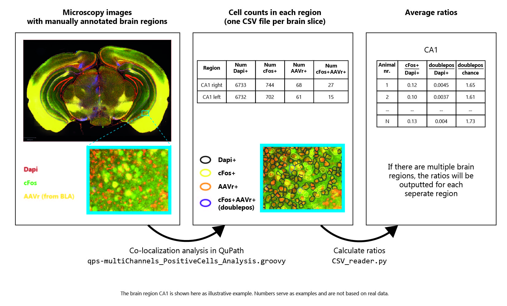

# Silva et al., Nature Neuroscience, 2021 
Code used to perform the analysis presented in *A thalamo-amygdalar circuit underlying the extinction of remote fear memories* (Silva et al., Nature Neuroscience, 2021).

## Abstract
Fear and trauma generate some of the longest-lived memories. Despite the corresponding need to understand how such memories can be attenuated, the underlying brain circuits remain unknown. Here, using neuronal circuit mapping, fiber photometry, chemogenetic and closed-loop optogenetic manipulations in mice, we show that the extinction of remote, i.e., 30-day old, fear memories depends on thalamic nucleus reuniens (NRe) inputs to the basolateral amygdala (BLA). We find that remote, but not recent, i.e., 1-day old, fear extinction activates NRe to BLA inputs, which become potentiated upon fear reduction. Both monosynaptic NRe to BLA, and total NRe activity increase shortly before freezing cessation, suggesting that the NRe registers and transmits safety signals to the BLA. Accordingly, pan-NRe and pathway-specific NRe to BLA inhibition impairs, while their activation facilitates fear extinction. These findings provide the first functional description of the circuits underlying extinction of consolidated fear memories, and identify the NRe as a crucial BLA regulator for extinction.

## Photometry Analysis
Code provided here was used to analyze the photometry data seen in Figure 3, Figure 5, Extended data Figure 6, and Extended data Figure 10. Example files are included in the data folder to help clarify some of the input information for code usage.

  1. `BinTimePoints.R`: Align time points and reduce raw output from 1-site 2-color Fiber Photometry System (Doric Lenses, Canada) into 10ms bins for downstream processing in Igor. Example input file in `photometry/data/RawPhotometry_Input/14586_Ext3_phase9_1.csv` and example output file in `photometry/data/RawPhotometry_Input/binned_output`
  2. Igor processing: Low pass filter and dF/F calculation
        - Run Igor command order from `/Igor/1.7 Hz filter_bsl Normalization on all.txt`
		- Delete first 600 points of waves to get rid of initial exponential decay
        - Low-pass filter at 1.7 Hz with Hanning (2.5 reject band)
        - Calculate  dF/Fo for 465 and 405 where Fo is median of the whole recording session (except the first 600 points)
        - Save files for further R analysis
		- Example output files in `photometry/data/Photometry_Input/Igor_output`
  4. Photometry Analysis
	 - Example photometry input files for these analysis can be found in `photometry/data/Photometry_Input/Igor_output` and  example freezing files can be found in `photometry/data/Photometry_Input/TSE_freezingOutput`
	 - `PhotometryAnalysis.R`:  Run full photometry analysis for each photometry file.
		- Align photometry (dF/Fo from Igor) and freezing data (raw data from TSE freezing detection software)
		- Plot overlay of photometry and freezing data for full duration of experiment
		- Plot average photometry output for 2 seconds surrounding the end of freezing bouts
		- Example output files in `/photometry/data/Photometry_Output/`
	 - `PhotometryAnalysis_byMouse.R`:  Calculate the photometry patterns during freezing for each animal in each phase. Example output files in `/photometry/data/Photometry_Output/byMouse`
	 - `PhotometryIntegralAnalysis.R`: Calculate signal power for photometry output. Example output in `/photometry/data/Photometry_Output/IntegralAnalysis.xlsx`

## Image Analysis
Code provided here was used to count the number of fluorescently labeled cells on microscopy images, and to convert these counts to the cFos+AAVr+/chance ratios presented in Figures 1d-i and Extended data Figure 1, 2, 8, 9.

   1. `qps-multiChannels_PositiveCells_Analysis.groovy`: Perform co-localization analysis of AAV2r, cFos and Dapi positive cells. This script outputs one .csv file for each microscopy image, containing the number of Dapi+, Dapi+AAVr+, Dapi+cFos+, and Dapi+cFos+AAVr for each brain region on the image. To run this script, we used the QuPath v0.1.3 software (https://qupath.github.io/). 
For example output files of this script, see `image analysis > example data > cell counts in mPFC`.

   2. `CSV_reader.py`: Convert cell counts found with the `.groovy` script into cFos+AAVr+/chance ratios for each brain region. Ratios are averaged over all brain slices available for each animal. To run this script, we used Python 3.7. An additional requirement is Pandas, which you can install with the command `conda install pandas`.  
For example output files of this script, see `image analysis > example data > ratios in mPFC`. The file `WT48_results_mPFC_BLA.csv` contains the chance ratios (of animals in one example experiment called WT48), and the directory `Raw_numbers_mPFC_BLA` contains the raw numbers with which the ratios were calculated.

   3. `QuPath.py`: Contains helper functions necessary for `CSV_reader.py`.
 
Overview of image analysis procedure: 

